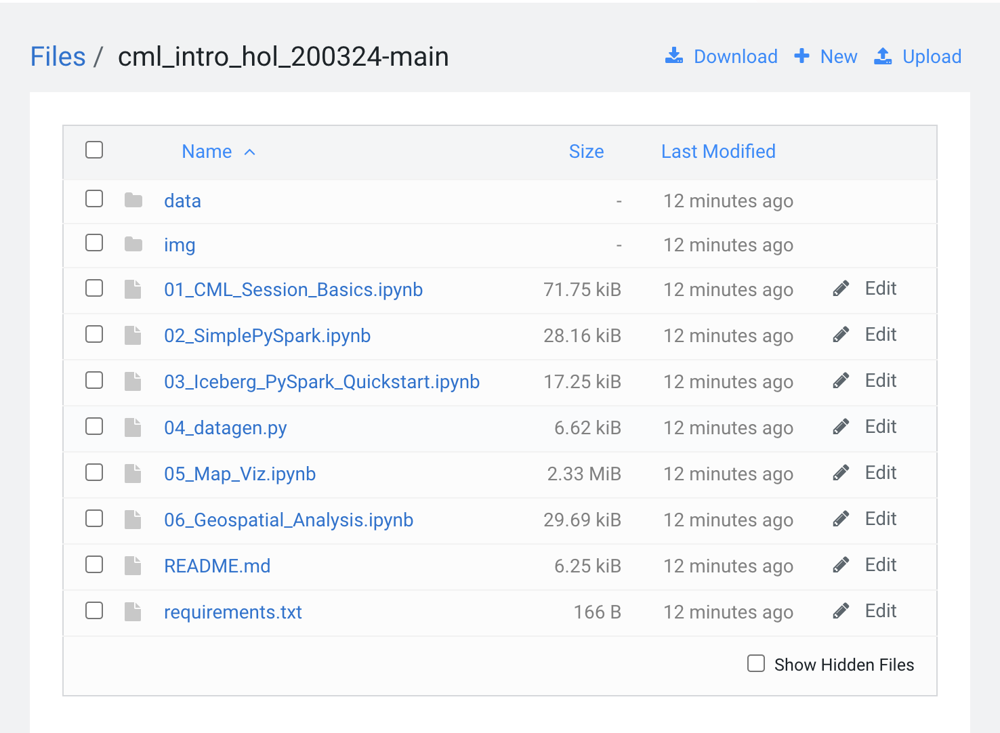

# CML Intro HOL 20/03/24

Cloudera Machine Learning es la plataforma de aprendizaje automático nativa en Cloud de Cloudera, construida para CDP. Cloudera Machine Learning unifica la ciencia de datos y la ingeniería de datos de autoservicio en un único servicio portátil como parte de Cloud empresariales para análisis multifuncionales de datos en cualquier lugar.

CML empodera a las organizaciones para construir e implementar capacidades de aprendizaje automático e IA para negocios a gran escala, de manera eficiente y segura, donde quieran. Está diseñado para la agilidad y potencia de la computación en la nube, pero no se limita a ningún proveedor de nube o fuente de datos en particular.


### Beneficios de CML

CML es una plataforma integral para implementar capacidades de aprendizaje automático de manera colaborativa a gran escala y proporciona beneficios para cada tipo de usuario:

##### Científicos de Datos

* CML permite a los equipos de DS colaborar y acelerar el desarrollo y entrega de modelos con flujos de trabajo transparentes, seguros y gobernados.
* CML Amplía los casos de uso de IA con pipelines de ML automatizados y un conjunto de herramientas de ML de producción integrado y completo.
* Facilita la toma de decisiones más rápida y confiable con visibilidad y auditabilidad de extremo a extremo de datos, procesos, modelos y paneles.

##### Equipos de IT

* CML aumenta la productividad de DS con visibilidad, seguridad y gobernabilidad de todo el ciclo de vida de ML.
* CML elimina silos, puntos ciegos y la necesidad de mover/duplicar datos con una plataforma completamente integrada en todo el ciclo de vida de datos.
* CML acelera la IA con acceso de autoservicio y espacios de trabajo de ML contenerizados que eliminan la carga pesada y llevan los modelos a producción más rápido.

##### Analistas y Otros Business Users

* CML accede a Aplicaciones interactivas construidas e implementadas por equipos de DS.
* Con CML se empodera con conocimientos predictivos para tomar decisiones comerciales de manera más inteligente.


### Capacidades Principales de CML

CML cubre el flujo de trabajo completo de aprendizaje automático, permitiendo cargas de trabajo completamente aisladas y contenerizadas, incluidos Python, R y Spark-on-Kubernetes, para ingeniería de datos a escala y aprendizaje automático con gestión distribuida de dependencias sin problemas.

* Las sesiones permiten a los científicos de datos aprovechar directamente la capacidad de cálculo de CPU, memoria y GPU disponibles en el espacio de trabajo, al mismo tiempo que están directamente conectados a los datos en el lago de datos.

* Los experimentos permiten a los científicos de datos ejecutar múltiples variaciones de cargas de trabajo de entrenamiento de modelos, rastreando los resultados de cada experimento para entrenar el mejor modelo posible.

* Los modelos pueden ser implementados en cuestión de clics, eliminando cualquier obstáculo para la producción. Se sirven como puntos finales REST de manera altamente disponible, con construcción de linaje automatizada y seguimiento de métricas para propósitos de MLOps.

* Los Job pueden ser utilizados para orquestar un pipeline automatizado completo de extremo a extremo, incluyendo monitoreo para el desvío del modelo y la activación automática de la reentrenamiento y re-implementación del modelo según sea necesario.

* Las aplicaciones ofrecen experiencias interactivas para usuarios comerciales en cuestión de clics. Marcos como Flask y Shiny pueden ser utilizados en el desarrollo de estas aplicaciones, mientras que Cloudera Data Visualization también está disponible como una interfaz de punto y clic para construir estas experiencias.


### Cloudera Data Platform (CDP)

La Plataforma de Datos de Cloudera (CDP) es un Cloud de datos empresariales que funciona como una plataforma tanto para equipos de IT como para usuarios. Incorpora soporte para un ambiente que se ejecuta tanto en las instalaciones como en una configuración de Public Cloud.

CDP es simple de usar y segura por diseño. Ofrece un ambiente común tanto para ingenieros de datos como para científicos de datos, apoyando la colaboración de equipos de ciencia de datos. Esto incluye seguridad de datos, gobernanza, linaje y control consistentes, mientras despliega análisis en la nube eficientes y fáciles de usar, eliminando la necesidad de soluciones de TI en la sombra para los usuarios finales.

* Secure By Design: cada parte de la arquitectura e infraestructura de su plataforma y aplicación se construye teniendo en cuenta la seguridad como consideración primaria. CDP despliega automáticamente un layer unificado de gobernanza y seguridad de datos y usuarios en todos sus ambientes para permitir que los equipos de IT implementen sólidas Best Practices para la autenticación, autorización y el monitoreo de todos los procesos de Cloud.

* Track and Audit Everything: CDP proporciona registros de auditoría centrados en los datos que explican de dónde provienen los datos, cómo llegaron a su estado actual y cómo se están utilizando. Cuando esos datos son procesados y analizados, las ideas resultantes también pueden ser clasificadas, incluyendo los datos a partir de los cuales se derivaron esas ideas.

* Aligned Practices across Environments: Prácticas consistentes en la gestión de ambientes en la nube resultarán en costos operativos reducidos y prácticas de seguridad más sencillas.


### Lab Instructions

En esta sesión introductoria te familiarizarás con los Proyectos de CML, Runtimes, Sesiones y Jobs.

* Utilizarás los Proyectos de CML para cargar rápidamente artefactos de ciencia de datos como scripts de desarrollo y conjuntos de datos, y aislar tu trabajo de los demás.

* Con los Runtimes de CML, podrás instalar rápidamente paquetes de Python, implementar aplicaciones distribuidas de Spark sin instalaciones engorrosas y aislar tus dependencias de otros container.

* Con las Sesiones de CML, desplegarás el container y todos los paquetes instalados en el Runtime para que puedas interactuar con tus datos y código de manera iterativa.

* Usando los Jobs de CML, desplegarás tu código como un batch job y opcionalmente programarás nuevas ejecuciones.


##### Despliegue de Proyecto

Descargue los archivos del proyecto en su computadora local.

1. Visite [este enlace](https://github.com/pdefusco/cml_intro_hol_200324)
2. Haz clic en "Código" y luego en "Descargar ZIP" para descargar todos los archivos.


Cree el proyecto.

1. Ingresa al Workspace de CML y haz clic en el ícono "Create Project".
2. En la sección "Configuración Inicial", haz clic en "Local Files" y luego en la opción "Upload Zip or Tar Archive".
3. Desplázate hacia abajo hasta la sección de Runtimes y agrega dos runtimes de Python 3.9. Agrega uno con el editor de JupyterLab y el otro con el editor de Workbench.


Ingresa al proyecto y familiarízate con los archivos que se han subido.




##### Despliegue de Sesión y Instalación de Paquetes en Runtime

Abre una sesión con las siguientes opciones de Runtime.

```
Editor: JupyterLab
Kernel: Python 3.9
Edition: Standard
Version: 2023 o 2024
Enable Spark: Spark 3.2
Resource Profile: 2 CPU / 4 GB Mem / 0 GPU
```


Después de unos momentos, se abrirá la interfaz de Notebook JupyterLab. Ejecute cada celda con "Shift-Enter". No se requieren cambios de código.


Note que el Notebook incluye algunos ejemplos de comandos "pip install". Con estos, los paquetes de Python se descargan en el Runtime del Proyecto. Si cierras tu sesión y vuelves más tarde, esos paquetes seguirán instalados en tu Proyecto.

Tu Proyecto de CML es, en efecto, tu ambiente privado de Python para exploración de datos y desarrollo de modelos, sin la molestia de instalaciones complejas y gestión de dependencias.  

##### Ejecución de Notebook

Keep executing the cells in each notebook. Detailed instructions to continue on are provided in each notebook.

* The rest of notebook 1 focuses on few simple commands, and the creation of a Project Environment variable.


* Notebook 2 provides an introduction to Spark-on-Kubernetes and Data Connections in CML. With CML you can easily deploy CML Sessions with Spark to analyze data and create models at scale. Data Connections provide premade code for connecting to different types of data sources, including deploying a Spark Session within your Notebook.


* Notebook 3 provides an introduction to Apache Iceberg in CML. Iceberg is a Table Format enabling Lakehouse Analytics on your data. In the context of Machine Learning it is beneficial because it allows you to switch between different versions of your data by including a timestamp or Snapshot ID in your query.


##### Despliegue de Job
